# Email System Evolution - Full AI Email Platform

## Architecture Overview

```mermaid
flowchart TD
    subgraph outbound [Outbound Flow]
        LeadFound[Lead Found] --> AIGen[AI Generates Email]
        AIGen --> Template[Uses Active Template + AI Training]
        Template --> Review[Review in Email UI]
        Review --> Approve{Approve}
        Approve --> SendEmail[Send via SMTP]
        SendEmail --> BrandedHTML["Branded HTML: Logo, Body, WhatsApp CTA, Socials"]
    end

    subgraph inbound [Inbound Flow - New]
        IMAP[IMAP Polling Service] --> NewEmail[New Email Detected]
        NewEmail --> MatchLead[Match to Lead by email/domain]
        MatchLead --> AIReply[AI Generates Reply]
        AIReply --> ReviewReply[Review in Inbox UI]
        ReviewReply --> ApproveReply{Approve}
        ApproveReply --> SendReply[Send Reply via SMTP]
    end

    subgraph training [AI Training - New]
        KnowledgeBase[Knowledge Base Items]
        SampleQA[Sample Q and A Pairs]
        Personality[Tone and Style Config]
        KnowledgeBase --> SystemPrompt[Enhanced System Prompt]
        SampleQA --> SystemPrompt
        Personality --> SystemPrompt
    end
```



---

## Phase 1: Email Template Branding + Remove WhatsApp Messages

### 1A. Configurable Branding in SystemSettings

Add new fields to the `SystemSettings` model in `prisma/schema.prisma`:

```prisma
// Add to SystemSettings model
companyName       String   @default("The Tiny Web Factory") @map("company_name")
companyWebsite    String   @default("https://thetinywebfactory.com") @map("company_website")
logoUrl           String?  @map("logo_url")       // URL to hosted logo image
bannerUrl         String?  @map("banner_url")      // URL to hosted banner image
whatsappPhone     String?  @map("whatsapp_phone")  // Company WhatsApp number for CTA
facebookUrl       String?  @map("facebook_url")
instagramUrl      String?  @map("instagram_url")
linkedinUrl       String?  @map("linkedin_url")
twitterUrl        String?  @map("twitter_url")
tiktokUrl         String?  @map("tiktok_url")
```

### 1B. Rebuild HTML Email Template

Rewrite `src/lib/email/templates/lead-outreach.ts`:

- Accept a `BrandingConfig` object (pulled from SystemSettings) instead of hardcoded values
- Add logo/banner in the header section (rendered as `` tag with the configurable URL)
- Replace the WhatsApp CTA emoji button with the actual **WhatsApp logo** using the official green WhatsApp icon hosted at a CDN URL (e.g., `https://cdn.jsdelivr.net/npm/simple-icons@v9/icons/whatsapp.svg` or a hosted PNG)
- Add a social links footer row: show only links that have URLs configured (Facebook, Instagram, LinkedIn, Twitter/X, TikTok) using their official brand icons
- Make the company name, website, and WhatsApp number all dynamic from config
- Add an "Email Preview" HTML rendering API route: `GET /api/email/preview` that returns rendered HTML for browser preview

### 1C. Remove WhatsApp Message Generation

- Remove `WHATSAPP` from the `MessageType` enum (or keep enum but stop generating)
- Update `src/app/api/ai/generate/route.ts`: only generate EMAIL type messages
- Update `src/lib/ai/personalize.ts`: remove WhatsApp-specific logic from `quickPersonalize`
- Update `src/lib/ai/prompts.ts`: remove WhatsApp format guidance from `generateMessagePrompt` and `generateFollowUpPrompt`
- Clean up `ApprovalGate.tsx` and `MessagePreview.tsx`: remove all WhatsApp-specific UI (Open in WhatsApp button, WhatsApp icons, phone display for WhatsApp, `formatPhoneNumber`/`getWhatsAppUrl` usage)
- Keep `getWhatsAppUrl` in utils.ts (still used for email CTA button)
- Update Sidebar: rename "Messages" to "Email" with `Mail` icon

### 1D. Branding Settings UI

Add a new "Branding" tab to `src/app/(dashboard)/settings/page.tsx`:

- Logo URL input with preview
- Banner URL input with preview
- Company name, website inputs
- WhatsApp phone number input
- Social media URL inputs (Facebook, Instagram, LinkedIn, Twitter/X, TikTok) - show only filled ones in email
- "Preview Email" button that opens `/api/email/preview` in a new tab with sample data
- "Send Test Email" button (already exists, reuse)
- Save button that PATCHes to `/api/settings`

Add `GET /api/email/preview` route that renders the HTML template with sample data and returns it directly as HTML (content-type: text/html) so the user can see exactly what emails look like.

---

## Phase 2: IMAP Inbox (Receive Emails)

### 2A. Schema Changes

New model in `prisma/schema.prisma`:

```prisma
enum EmailDirection {
  INBOUND
  OUTBOUND
}

model InboundEmail {
  id            String   @id @default(cuid())
  messageId     String   @unique @map("message_id")  // IMAP Message-ID header
  from          String
  to            String
  subject       String
  bodyText      String?  @db.Text @map("body_text")
  bodyHtml      String?  @db.Text @map("body_html")
  receivedAt    DateTime @map("received_at")
  isRead        Boolean  @default(false) @map("is_read")
  isProcessed   Boolean  @default(false) @map("is_processed")

  // Link to lead if matched
  leadId        String?  @map("lead_id")
  lead          Lead?    @relation(fields: [leadId], references: [id])

  // AI-generated reply
  aiReplyId     String?  @map("ai_reply_id")

  createdAt     DateTime @default(now()) @map("created_at")
  updatedAt     DateTime @updatedAt @map("updated_at")

  @@index([from])
  @@index([leadId])
  @@index([isProcessed])
  @@map("inbound_emails")
}
```

Add IMAP env vars to config: `IMAP_HOST`, `IMAP_PORT`, `IMAP_USER`, `IMAP_PASS`, `IMAP_TLS`.

Add `Lead` relation: `inboundEmails InboundEmail[]`

### 2B. IMAP Service

New file: `src/lib/email/imap.ts`

- Use the `imapflow` npm package (modern, Promise-based IMAP client)
- `fetchNewEmails()`: connects to IMAP, fetches unseen messages from INBOX, parses them, stores in `InboundEmail` table
- `matchEmailToLead()`: matches sender email/domain to existing leads
- Mark emails as seen after processing

New file: `src/app/api/email/inbox/route.ts`

- `GET`: List inbound emails with pagination, filters (read/unread, matched/unmatched)
- `POST`: Trigger manual IMAP fetch

New file: `src/app/api/email/inbox/[id]/route.ts`

- `GET`: Single inbound email with lead details
- `PATCH`: Mark as read, link to lead
- `DELETE`: Delete inbound email

### 2C. Inbox UI

Redesign the Messages page (`src/app/(dashboard)/messages/page.tsx`) into an email-centric layout:

- Rename to "Email" in the sidebar
- **Left panel**: Email list (like the reference `EmailList` component) - shows both inbound and outbound in a unified inbox sorted by date
- **Right panel**: Email detail view (like the reference `EmailDetail` component) - shows the email content, AI response, and approve/reject/send actions
- Tabs at the top: Inbox (inbound), Outbox (pending outbound), Sent, All
- Each email shows: from/to, subject, time, status badge (Pending/Approved/Sent/Failed)
- For inbound: show AI-generated reply with approve/reject/regenerate
- For outbound: show the existing approve/send workflow

---

## Phase 3: AI Training Page

### 3A. Schema Changes

```prisma
model AIKnowledgeItem {
  id        String   @id @default(cuid())
  title     String
  content   String   @db.Text
  category  String?
  createdAt DateTime @default(now()) @map("created_at")
  updatedAt DateTime @updatedAt @map("updated_at")
  @@map("ai_knowledge_items")
}

model AISampleResponse {
  id               String   @id @default(cuid())
  customerQuestion String   @db.Text @map("customer_question")
  preferredResponse String  @db.Text @map("preferred_response")
  category         String?
  createdAt        DateTime @default(now()) @map("created_at")
  updatedAt        DateTime @updatedAt @map("updated_at")
  @@map("ai_sample_responses")
}
```

Add to `SystemSettings`:

```prisma
aiTone             String?  @map("ai_tone")          // "formal", "professional-friendly", "casual", "enthusiastic"
aiWritingStyle     String?  @map("ai_writing_style")  // "concise", "detailed", "storytelling"
aiCustomInstructions String? @db.Text @map("ai_custom_instructions")
```

### 3B. AI Training API

- `GET/POST /api/ai/knowledge` - CRUD for knowledge base items
- `GET/POST /api/ai/knowledge/[id]` - Individual knowledge item operations
- `GET/POST /api/ai/samples` - CRUD for sample Q&A pairs
- `PATCH /api/ai/training` - Update AI personality settings (tone, style, custom instructions)
- `GET /api/ai/training` - Get current AI training config

### 3C. Wire Training into AI Generation

Update `src/lib/ai/prompts.ts`:

- `buildEnhancedSystemPrompt()`: new function that combines:
  1. Template system prompt (from EmailTemplate)
  2. AI personality settings (tone, style, custom instructions from SystemSettings)
  3. Knowledge base items (fetched from AIKnowledgeItem)
  4. Sample responses (fetched from AISampleResponse)
- This replaces the current `buildSystemPromptFromTemplate()` as the primary prompt builder

### 3D. AI Training Page UI

New page or rename `src/app/(dashboard)/templates/page.tsx` to serve as the "AI Training" page (rename nav item from "Templates" to "AI Training" with `Brain` icon):

- **How Training Works** card (info/explainer at top, like reference)
- **AI Personality and Tone** card: tone selector, writing style selector, custom instructions textarea
- **Sample Responses** card: list of Q&A examples with add/edit/delete
- **Business Knowledge Base** card: list of knowledge items with add/edit/delete
- **Save AI Training** button

### 3E. Email Templates Page (Separate)

Keep a simplified templates page (accessible from AI Training or as a sub-section), styled like the reference `EmailTemplates` component:

- Grid layout with template cards
- Search and category filter
- Usage statistics at top
- Create/edit dialog with subject, body, category
- Copy/use template button
- This maps to the existing `EmailTemplate` model but with better UX

---

## Phase 4: Branding Settings Tab

Add to the existing Settings page Email tab or as a new "Branding" tab:

- All the social media URLs
- Logo URL + preview
- WhatsApp phone number
- "Preview Email" button
- Persisted in SystemSettings

---

## File Changes Summary

**New files:**

- `src/lib/email/imap.ts` - IMAP polling service
- `src/app/api/email/inbox/route.ts` - Inbox API
- `src/app/api/email/inbox/[id]/route.ts` - Single inbound email API
- `src/app/api/email/preview/route.ts` - Email HTML preview
- `src/app/api/ai/knowledge/route.ts` - Knowledge base CRUD
- `src/app/api/ai/knowledge/[id]/route.ts` - Single knowledge item
- `src/app/api/ai/samples/route.ts` - Sample responses CRUD
- `src/app/api/ai/samples/[id]/route.ts` - Single sample response
- `src/app/api/ai/training/route.ts` - AI personality config
- `src/app/(dashboard)/training/page.tsx` - AI Training page

**Major rewrites:**

- `src/lib/email/templates/lead-outreach.ts` - Branded template with logo, WhatsApp icon, social links
- `src/app/(dashboard)/messages/page.tsx` - Email inbox/outbox layout
- `src/app/(dashboard)/templates/page.tsx` - Grid-style templates with search/categories
- `src/components/messages/ApprovalGate.tsx` - Remove WhatsApp, email-only
- `src/components/messages/MessagePreview.tsx` - Remove WhatsApp, email-only

**Modified:**

- `prisma/schema.prisma` - New models + SystemSettings fields
- `src/lib/ai/prompts.ts` - Remove WhatsApp, add training integration
- `src/lib/ai/personalize.ts` - Remove WhatsApp, use enhanced prompts
- `src/components/layout/Sidebar.tsx` - Rename items, add AI Training
- `src/app/(dashboard)/settings/page.tsx` - Add Branding tab
- `src/app/api/settings/route.ts` - Handle new branding fields

## Implementation Order

Phase 1 first (branding + remove WhatsApp) since it's immediately testable via the preview and test email features. Then Phase 3 (AI Training) for the knowledge base. Then Phase 2 (IMAP inbox) as the most complex piece. Phase 4 is woven into Phase 1.
