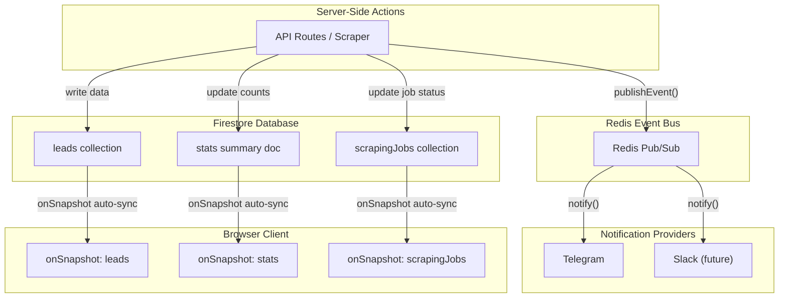

# Event-Driven Realtime System Overhaul

## Problem Analysis

The current architecture uses a three-link chain for client updates: **Redis Pub/Sub -> SSE Endpoint -> Browser EventSource**. I found **6 bugs/design flaws** that cause the connection to silently die:

### Bug 1: Redis subscriber never reconnects

In `[src/lib/events.ts](src/lib/events.ts)` line 155, the subscriber is configured with `retryStrategy: () => null`. When Redis drops, the subscriber dies permanently. The SSE connection stays alive via heartbeats, but **no events flow** -- and the client has no way to know.

### Bug 2: No Redis subscriber health monitoring in the SSE endpoint

In `[src/app/api/events/route.ts](src/app/api/events/route.ts)`, once the Redis subscriber is created (line 102), there are no listeners for `close`, `end`, or `error` events on the subscriber. If Redis disconnects, the SSE endpoint never notifies the client.

### Bug 3: Client gives up permanently after 5 reconnect attempts

In `[src/hooks/use-realtime.ts](src/hooks/use-realtime.ts)` line 189, after 5 failed attempts, the client stops trying permanently. The user must manually click "refresh." There is no periodic retry or visibility-change-based retry.

### Bug 4: "Silent dead connection" -- heartbeats mask subscriber failure

If the Redis subscriber dies, the SSE heartbeat keeps running (every 30s). The client sees heartbeats, reports `isConnected: true`, but receives zero events. The `hasRedis` state is never updated to `false` after initial connection.

### Bug 5: Browser tab sleep kills SSE connections

When a browser tab is backgrounded or the device sleeps, the OS may terminate the SSE connection. On wake, the 45-second heartbeat timeout eventually triggers reconnection, but the delay feels laggy and unreliable.

### Bug 6: SSE reconnection backoff is too aggressive

After a successful connection that drops, the first retry delay is 30 seconds (`MIN_RECONNECT_DELAY`). Combined with the 45-second heartbeat timeout, a reconnection can take up to **75 seconds** before events resume.

## Proposed Architecture

Replace the fragile SSE transport with **Firestore real-time listeners** for all client-facing updates. Keep Redis pub/sub exclusively as the server-side event bus for notifications.

### Why Firestore listeners instead of fixing SSE?

- **Automatic reconnection** -- Firestore SDK handles disconnects, tab sleep, and network changes natively
- **Offline persistence** -- updates queue offline and sync when back online
- **Delta updates** -- only changed documents are sent over the wire
- **No intermediate server** -- client connects directly to Firestore, eliminating the SSE endpoint as a failure point
- **Already in the stack** -- Firebase/Firestore is the primary database; no new dependencies needed

### Why keep Redis pub/sub?

Redis remains the ideal server-side event bus because:

- Notifications (Telegram, Slack) are triggered server-side and dont need Firestore listeners
- Server-to-server communication (e.g., scraper -> notification manager) is well-served by Redis
- It decouples notification logic from database writes

## Implementation Plan

### Phase 1: Create Firestore real-time hooks (replace SSE on the client)

**New file: `src/hooks/use-firestore-realtime.ts**`

Create three hooks using the Firestore client SDK's `onSnapshot`:

- `useLeadsFirestore(teamId)` -- listens to `teams/{teamId}/leads` collection, returns reactive leads array. Replaces `useLeadsRealtime()`.
- `useStatsFirestore(teamId)` -- listens to a `teams/{teamId}/stats/summary` document for pre-computed stats. Replaces `useStatsRealtime()`.
- `useScraperJobsFirestore(teamId)` -- listens to `teams/{teamId}/scrapingJobs` collection filtered by active status. Replaces polling on the scraper page.

Each hook will:

- Accept a `teamId` parameter
- Return `{ data, isLoading, error }`
- Handle connection state via Firestore's `onSnapshot` metadata (`fromCache`, `hasPendingWrites`)
- Clean up the listener on unmount

### Phase 2: Add a stats summary document (server-side)

Currently stats are computed by fetching all leads and counting. Create a **stats summary document** (`teams/{teamId}/stats/summary`) that gets updated atomically whenever leads change:

- **File to modify: `[src/lib/events.ts](src/lib/events.ts)**` -- after publishing events to Redis, also update the stats summary doc in Firestore using Firestore increment operations
- **New helper: `src/lib/firebase/stats.ts**`-- functions like`incrementLeadCount(teamId, status)`, `decrementLeadCount(teamId, status)`, `changeLeadStatus(teamId, oldStatus, newStatus)`using Firestore`FieldValue.increment()`
- This avoids expensive re-aggregation queries on every update

### Phase 3: Update consumer components

Replace SSE-based hooks with Firestore hooks in:

- `**[src/components/kanban/Board.tsx](src/components/kanban/Board.tsx)**` -- replace `useLeadsRealtime(refreshLeads)` with `useLeadsFirestore(teamId)`, removing the separate `fetchLeads` + refresh pattern
- `**[src/components/dashboard/DashboardStats.tsx](src/components/dashboard/DashboardStats.tsx)**` -- replace `useStatsRealtime(refreshStats)` with `useStatsFirestore(teamId)`, removing the separate `/api/stats` fetch
- `**[src/app/(dashboard)/scraper/page.tsx](<src/app/(dashboard)`/scraper/page.tsx>) -- replace 3-5 second polling with `useScraperJobsFirestore(teamId)`

### Phase 4: Clean up SSE infrastructure

- **Remove** `[src/app/api/events/route.ts](src/app/api/events/route.ts)` (SSE endpoint)
- **Remove** `[src/hooks/use-realtime.ts](src/hooks/use-realtime.ts)` (SSE hooks)
- **Simplify** `[src/lib/events.ts](src/lib/events.ts)` -- remove `createSubscriber()` and `subscribeToEvents()` (subscriber-side). Keep `publishEvent()` and the `events.*` helpers for server-side notification dispatching via Redis.
- Remove Redis subscriber configuration (publisher-only going forward)

### Phase 5: Ensure notification pipeline remains intact

Verify that the server-side event flow still works:

- `publishEvent()` in `[src/lib/events.ts](src/lib/events.ts)` still publishes to Redis
- `notify()` in `[src/lib/notifications/manager.ts](src/lib/notifications/manager.ts)` still dispatches to Telegram/Slack
- All API routes that call `events.leadCreated()`, etc. continue to work unchanged
- The only change is that Redis pub/sub no longer has SSE subscriber consumers -- only the notification manager consumes events
