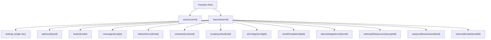

# Migrate from PostgreSQL/Prisma to Firebase (Firestore + Auth)

## Why Firebase

Given the goal of a free, full ecosystem, **Firebase** is the strongest fit:

- **Firestore** (NoSQL document DB): 1GB storage, 50K reads/day, 20K writes/day, 20K deletes/day on the free Spark plan
- **Firebase Auth**: Free for email/password, Google, GitHub, etc. -- replaces NextAuth + bcrypt entirely
- **No server to manage**: No PostgreSQL instance to host or maintain
- **Real-time**: Firestore listeners give you live dashboard updates for free
- The data model is largely hierarchical (Team -> Leads -> Messages) which maps naturally to Firestore collections/subcollections

### Alternative considered

**MongoDB Atlas** (512MB free tier) is viable but is database-only -- you'd still need NextAuth for auth, and there's no integrated hosting/auth/functions ecosystem. Firebase gives you more out of the box.

---

## Honest Trade-offs

Before committing, these are the real costs of migrating:

| Area                                                | Current (PostgreSQL)       | Firebase                                                                          |
| --------------------------------------------------- | -------------------------- | --------------------------------------------------------------------------------- |
| **Full-text search** (`contains`, case-insensitive) | Native                     | Not supported -- need to store lowercase copies of fields or use a search service |
| **Aggregations** (`groupBy` in stats)               | Native                     | Must use Firestore `count()`/`sum()` aggregation queries or compute client-side   |
| **Pagination**                                      | Offset-based (`skip/take`) | Cursor-based only (no "jump to page 5")                                           |
| **Unique constraints** (e.g., email)                | Database-enforced          | Must be enforced in application code or via Firebase Auth                         |
| **Migration scope**                                 | --                         | ~40+ files touch Prisma and need rewriting                                        |
| **Scraper/BullMQ**                                  | Redis queue                | Still needs Redis; Playwright can't run in Cloud Functions                        |

None of these are blockers, but they require code changes and some design adjustments.

---

## Firestore Data Model

The current relational schema maps to a subcollection-based Firestore structure. Using `teams/{teamId}` as the root naturally enforces multi-tenancy without needing `teamId` filters.

Key design decisions:

- `**users**` is top-level (Firebase Auth manages users globally, not per-team)
- `**messages**` and `**statusHistory**` are flat subcollections under `teams` (not nested under leads) so they can be queried independently (e.g., "all pending messages for this team")
- `**settings**` is a single document per team, not a subcollection
- Each `message` and `statusHistory` doc stores a `leadId` field for filtering by lead
- **No `passwordHash**` needed -- Firebase Auth handles credentials

---

## Migration Phases

### Phase 1: Firebase Setup and Data Access Layer

- Create a Firebase project (Spark/free plan)
- Enable Firestore and Firebase Auth (email/password provider)
- Install `firebase-admin` (server-side) and `firebase` (client-side) SDKs
- Create a Firestore service layer (`src/lib/firebase/`) that mirrors the current Prisma patterns:
  - `src/lib/firebase/admin.ts` -- Firebase Admin SDK init (for API routes)
  - `src/lib/firebase/client.ts` -- Firebase client SDK init (for client components)
  - `src/lib/firebase/collections.ts` -- typed collection references and helpers

### Phase 2: Auth Migration

- Replace NextAuth + bcrypt with Firebase Auth
- Update [src/lib/auth.ts](src/lib/auth.ts) and [src/lib/auth.config.ts](src/lib/auth.config.ts) to use Firebase Admin SDK for session verification
- Update [src/middleware.ts](src/middleware.ts) to verify Firebase ID tokens instead of NextAuth sessions
- Update [src/app/api/auth/register/route.ts](src/app/api/auth/register/route.ts) to create users via `admin.auth().createUser()`
- Update [src/app/(auth)/login/page.tsx](<src/app/(auth)/login/page.tsx>) to use `signInWithEmailAndPassword` from Firebase client SDK
- Store `teamId` and `role` as Firebase Auth custom claims (accessible in security rules and server-side)
- Remove `@auth/prisma-adapter`, `next-auth`, `bcryptjs`

### Phase 3: API Route Migration (largest phase)

Rewrite every API route to use Firestore instead of Prisma. The patterns translate roughly as:

- `prisma.lead.findMany({ where: { teamId }, orderBy, skip, take })` becomes `db.collection('teams').doc(teamId).collection('leads').orderBy(...).startAfter(cursor).limit(n).get()`
- `prisma.lead.findFirst({ where: { id, teamId } })` becomes `db.collection('teams').doc(teamId).collection('leads').doc(id).get()`
- `prisma.lead.create({ data })` becomes `.doc().set(data)`
- `prisma.lead.update({ where, data })` becomes `.doc(id).update(data)`
- `prisma.lead.groupBy(...)` becomes a `getCountFromServer()` / `getAggregateFromServer()` call or client-side aggregation

Files to migrate (all in `src/app/api/`):

- `leads/route.ts`, `leads/[id]/route.ts`, `leads/[id]/status/route.ts`, `leads/clear-new/route.ts`
- `messages/route.ts`, `messages/[id]/route.ts`, `messages/[id]/approve/route.ts`, `messages/[id]/resend/`
- `messages/follow-up/`
- `contacts/route.ts`, `contacts/[id]/route.ts`
- `scraper/route.ts`, `scraper/[id]/route.ts`
- `settings/route.ts`, `settings/email-config/`
- `stats/route.ts`, `history/route.ts`
- `ai/config/route.ts`, `ai/generate/route.ts`, `ai/keys/`, `ai/knowledge/`, `ai/samples/`, `ai/training/`
- `templates/`, `email/`, `setup/`

### Phase 4: Search and Pagination Adjustments

- For text search (currently `contains` + `mode: insensitive`): store lowercase copies of searchable fields (`businessNameLower`, `locationLower`) and query with `>=` / `<=` prefix matching, or implement a simple search index collection
- Convert offset-based pagination to cursor-based using Firestore's `startAfter()` -- update frontend components to use "load more" or infinite scroll instead of page numbers
- For stats aggregations: use Firestore's `getAggregateFromServer()` for counts, or maintain a `teamStats` document updated via batched writes

### Phase 5: Scraper and Background Jobs

- The Playwright scraper and BullMQ job queue still need Redis -- this stays unchanged
- Update [src/lib/scraper/google-maps.ts](src/lib/scraper/google-maps.ts) to write results to Firestore instead of Prisma
- Update [src/lib/scraper/scheduler.ts](src/lib/scraper/scheduler.ts) similarly

### Phase 6: Cleanup

- Remove all Prisma dependencies: `prisma`, `@prisma/client`, `@prisma/adapter-pg`, `@auth/prisma-adapter`, `pg`, `@types/pg`
- Delete `prisma/` directory (schema, migrations, seed)
- Remove database-related npm scripts (`db:generate`, `db:migrate`, `db:push`, `db:seed`, `db:studio`, `db:reset`)
- Update `.env.example` to use Firebase config vars instead of `DATABASE_URL`
- Write Firestore security rules for multi-tenancy enforcement
- Create a seed script using Firebase Admin SDK
- Update `postinstall` script (currently runs `prisma generate`)

---

## Dependencies to Add

- `firebase-admin` -- server-side (API routes, middleware)
- `firebase` -- client-side (auth UI, optional real-time listeners)

## Dependencies to Remove

- `prisma`, `@prisma/client`, `@prisma/adapter-pg`, `@auth/prisma-adapter`, `pg`, `@types/pg`
- `next-auth` (replaced by Firebase Auth)
- `bcryptjs`, `@types/bcryptjs` (Firebase Auth handles password hashing)

## Estimated Scope

This is a **large migration** -- roughly 40-50 files need changes. The data access patterns are straightforward to translate, but the sheer number of files makes this a multi-session effort. I'd estimate 3-5 focused sessions to complete all phases.
