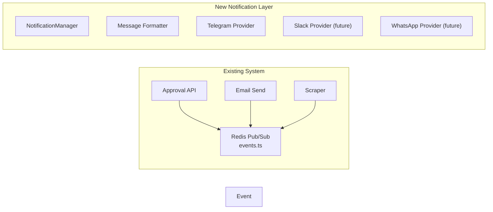

# Messaging Platform Notification Integration

## Architecture

The system hooks into the existing Redis pub/sub event system in `[src/lib/events.ts](src/lib/events.ts)` and routes events to configured messaging providers. A provider abstraction makes it trivial to add new platforms.

