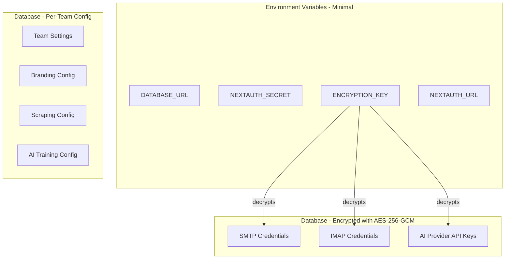
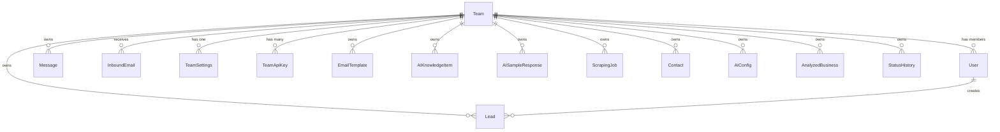

# Multi-Tenancy, Encrypted Secrets, and Setup Wizard

## Architecture





## What stays in `.env`

Only infrastructure-level secrets that CANNOT be in the database:

- `DATABASE_URL` -- connection to the DB itself
- `NEXTAUTH_SECRET` -- JWT signing key
- `NEXTAUTH_URL` -- app URL for auth callbacks
- `ENCRYPTION_KEY` -- 32-byte hex key for AES-256-GCM (protects all DB secrets)

Everything else moves to the database, encrypted where needed, scoped per team.

---

## Phase 1: Encryption Utility + Team Model

### 1A. AES-256-GCM Encryption Utility

Create [src/lib/crypto.ts](src/lib/crypto.ts):

- `encrypt(plaintext: string): string` -- returns `iv:ciphertext:authTag` as a single string
- `decrypt(encrypted: string): string` -- splits and decrypts
- Uses `crypto.createCipheriv('aes-256-gcm', key, iv)` from Node.js built-in `crypto`
- Master key read from `process.env.ENCRYPTION_KEY` (32-byte hex = 64 hex chars)
- Random 12-byte IV per encryption (prevents pattern analysis)
- Auth tag prevents tampering
- Helper: `generateEncryptionKey()` for initial setup

### 1B. Team Model + Schema Changes

Update [prisma/schema.prisma](prisma/schema.prisma):

**New models:**

```
model Team {
  id        String   @id @default(cuid())
  name      String
  slug      String   @unique
  createdAt DateTime @default(now())
  updatedAt DateTime @updatedAt

  // Relations
  users             User[]
  settings          TeamSettings?
  apiKeys           TeamApiKey[]
  leads             Lead[]
  messages          Message[]
  inboundEmails     InboundEmail[]
  emailTemplates    EmailTemplate[]
  aiKnowledgeItems  AIKnowledgeItem[]
  aiSampleResponses AISampleResponse[]
  scrapingJobs      ScrapingJob[]
  contacts          Contact[]
  aiConfigs         AIConfig[]
  analyzedBusinesses AnalyzedBusiness[]
  statusHistory     StatusHistory[]
}

model TeamSettings {
  id     String @id @default(cuid())
  teamId String @unique

  // All fields currently in SystemSettings move here
  // (branding, scraping, AI training, lead gen, etc.)

  // NEW: Email config (secrets encrypted)
  smtpHost          String?
  smtpPort          Int      @default(587)
  smtpSecure        Boolean  @default(false)
  smtpUser          String?            // encrypted
  smtpPass          String?            // encrypted
  emailFrom         String?
  emailDebugMode    Boolean  @default(false)
  emailDebugAddress String?

  // NEW: IMAP config (secrets encrypted)
  imapHost          String?
  imapPort          Int      @default(993)
  imapSecure        Boolean  @default(true)
  imapUser          String?            // encrypted
  imapPass          String?            // encrypted

  team Team @relation(fields: [teamId], references: [id], onDelete: Cascade)
}

model TeamApiKey {
  id         String   @id @default(cuid())
  teamId     String
  provider   String               // e.g., "OPENROUTER", "OPENAI"
  encryptedKey String             // AES-256-GCM encrypted
  label      String?              // user-friendly label
  isActive   Boolean  @default(true)
  createdAt  DateTime @default(now())
  updatedAt  DateTime @updatedAt

  team Team @relation(fields: [teamId], references: [id], onDelete: Cascade)

  @@unique([teamId, provider])
}
```

**Add `teamId` to all existing data models:**

- `User` -- add `teamId String?` + relation (nullable during migration)
- `Lead` -- add `teamId String` + relation
- `Message` -- add `teamId String` + relation
- `StatusHistory` -- add `teamId String` + relation
- `AIConfig` -- add `teamId String` + relation
- `ScrapingJob` -- add `teamId String` + relation
- `AnalyzedBusiness` -- add `teamId String` + relation
- `Contact` -- add `teamId String` + relation
- `EmailTemplate` -- add `teamId String` + relation
- `AIKnowledgeItem` -- add `teamId String` + relation
- `AISampleResponse` -- add `teamId String` + relation
- `InboundEmail` -- add `teamId String` + relation

Add `@@index([teamId])` to each.

**Remove:** `SystemSettings` model (replaced by `TeamSettings`).

### 1C. Auth/Session Changes

Update [src/lib/auth.ts](src/lib/auth.ts):

- Add `teamId` to the JWT token and session object
- When a user logs in, resolve their team and include it in the session
- Create helper: `getTeamId(session)` for use in API routes

Update [src/types/next-auth.d.ts](src/types/next-auth.d.ts) (or create it):

- Extend `Session` and `JWT` types with `teamId: string`

### 1D. Setup Wizard

Create [src/app/(auth)/setup/page.tsx](<src/app/(auth)/setup/page.tsx>):

- Shown on first launch when no teams exist in the database
- Steps:
  1. **Create Account** -- name, email, password
  2. **Create Team** -- team name (generates slug)
  3. **Configure Email (optional)** -- SMTP host/port/user/pass, IMAP config
  4. **Add AI Key (optional)** -- provider selector + API key input
- On submit: creates Team, TeamSettings, User (ADMIN role), and optionally TeamApiKey
- Encrypts all secrets before storing

Update [src/middleware.ts](src/middleware.ts):

- Check if any team exists; if not, redirect all routes to `/setup`
- After setup, redirect to login

**Remove from seed:** Admin user creation and env var reads for `ADMIN_EMAIL`, `ADMIN_PASSWORD`.

---

## Phase 2: Migrate Config Readers to Database

### 2A. Email Config from DB

Rewrite [src/lib/email/config.ts](src/lib/email/config.ts):

- `getEmailConfig(teamId)` -- fetches from `TeamSettings` instead of env vars
- `getImapConfig(teamId)` -- fetches from `TeamSettings`
- Decrypts `smtpUser`, `smtpPass`, `imapUser`, `imapPass` using the crypto utility
- `isSmtpConfigured(teamId)` and `isImapConfigured(teamId)` check DB values
- `getMaskedSmtpConfig(teamId)` masks DB values

### 2B. AI Provider Keys from DB

Rewrite [src/lib/ai/providers.ts](src/lib/ai/providers.ts):

- `getProviderApiKey(teamId, provider)` -- fetches from `TeamApiKey`, decrypts
- `isProviderAvailable(teamId, provider)` -- checks DB
- `getProviderStatus(teamId)` -- returns status for all providers from DB
- Remove all `process.env` reads for API keys

### 2C. Scraping Config from DB

Update scraping code in [src/lib/scraper/scheduler.ts](src/lib/scraper/scheduler.ts):

- Read `scrapeDelayMs` from `TeamSettings` instead of `process.env.SCRAPE_DELAY_MS`
- Pass `teamId` through scraping job context

### 2D. Update All API Routes

Every API route that currently reads settings or creates data needs to:

1. Extract `teamId` from the session
2. Filter all queries by `teamId`
3. Include `teamId` when creating records
4. Read config from `TeamSettings` instead of env/SystemSettings

Key files to update (non-exhaustive):

- [src/app/api/settings/route.ts](src/app/api/settings/route.ts) -- read/write `TeamSettings`
- [src/app/api/leads/route.ts](src/app/api/leads/route.ts) -- scope by team
- [src/app/api/messages/route.ts](src/app/api/messages/route.ts) -- scope by team
- [src/app/api/email/inbox/route.ts](src/app/api/email/inbox/route.ts) -- scope by team
- [src/app/api/ai/generate/route.ts](src/app/api/ai/generate/route.ts) -- use team API key
- [src/app/api/ai/knowledge/route.ts](src/app/api/ai/knowledge/route.ts) -- scope by team
- [src/app/api/ai/samples/route.ts](src/app/api/ai/samples/route.ts) -- scope by team
- [src/app/api/ai/training/route.ts](src/app/api/ai/training/route.ts) -- scope by team
- [src/app/api/ai/config/route.ts](src/app/api/ai/config/route.ts) -- scope by team
- [src/app/api/templates/route.ts](src/app/api/templates/route.ts) -- scope by team
- [src/app/api/email/status/route.ts](src/app/api/email/status/route.ts) -- read team SMTP config
- [src/app/api/email/send-test/route.ts](src/app/api/email/send-test/route.ts) -- use team SMTP
- [src/app/api/email/preview/route.ts](src/app/api/email/preview/route.ts) -- use team branding
- All approve/resend/follow-up routes
- Scraper routes

---

## Phase 3: Settings UI for Secrets

### 3A. SMTP/IMAP Config UI

Update [src/app/(dashboard)/settings/page.tsx](<src/app/(dashboard)/settings/page.tsx>) Email tab:

- Replace env var display with editable form fields
- SMTP: host, port, secure toggle, user, password (masked input)
- IMAP: host, port, secure toggle, user, password (masked input)
- Save button that PATCHes to `/api/settings` (encrypts before storing)
- Test Connection buttons work the same but read from DB

### 3B. API Keys Management UI

Add "API Keys" section to Settings (or the AI Config tab):

- List current team API keys (masked)
- Add new key: provider dropdown + key input
- Delete/rotate keys
- PATCH `/api/ai/keys` endpoints

### 3C. New API Routes for Secrets

Create [src/app/api/settings/email-config/route.ts](src/app/api/settings/email-config/route.ts):

- `PATCH` -- accepts SMTP/IMAP config, encrypts secrets, stores in `TeamSettings`
- `GET` -- returns masked config (never returns raw secrets)

Create [src/app/api/ai/keys/route.ts](src/app/api/ai/keys/route.ts):

- `GET` -- list team API keys (masked)
- `POST` -- add new key (encrypt and store)
- `DELETE` -- remove key

---

## Phase 4: Data Migration

### 4A. Migration Script

Create a migration script that:

1. Creates a default team from existing `SystemSettings`
2. Assigns all existing users to the default team
3. Assigns all existing leads, messages, etc. to the default team
4. Copies `SystemSettings` values to new `TeamSettings`
5. If SMTP/IMAP/API keys exist in env vars, encrypts and stores them in DB
6. Marks migration as complete

### 4B. Clean Up

- Remove `SystemSettings` model
- Remove env var reads for SMTP, IMAP, AI keys, scraping config, admin user
- Update `.env.example` to only show the 4 required vars
- Update seed.ts to only create default email templates (team-scoped via setup wizard)

---

## Security Considerations

- **Encryption key rotation**: Document how to rotate `ENCRYPTION_KEY` (decrypt all, re-encrypt with new key)
- **Frontend never sees raw secrets**: API routes return masked values only
- **ADMIN-only access**: Only team admins can view/modify secrets
- **Audit trail**: Consider logging when secrets are accessed/modified (future enhancement)
- **SQL injection**: Prisma parameterizes all queries (already safe)
- **XSS**: Next.js escapes output by default (already safe)
