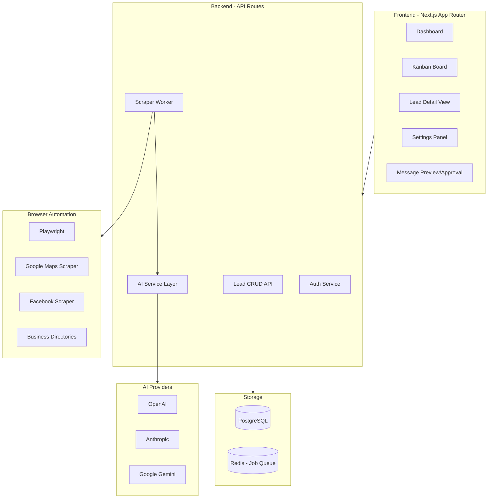
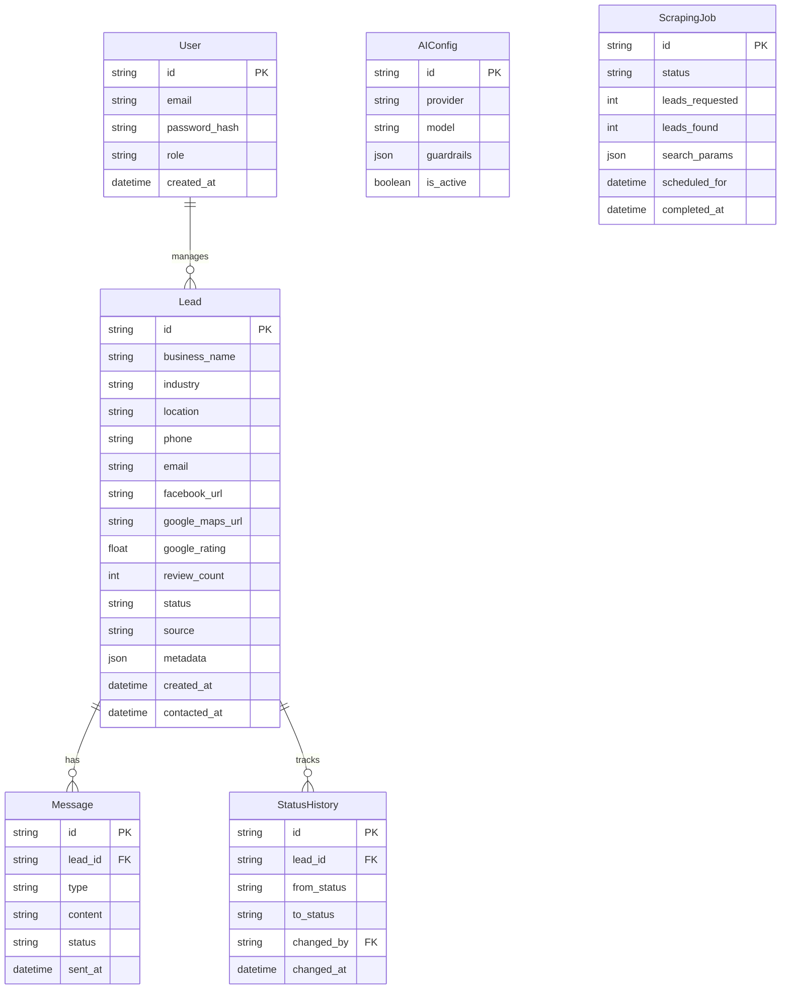

# AI-Powered Lead Generation & Tracking Tool

## Architecture Overview



## Tech Stack

| Layer              | Technology               | Rationale                                      |
| ------------------ | ------------------------ | ---------------------------------------------- |
| Framework          | Next.js 14 (App Router)  | Full-stack React with API routes, excellent DX |
| UI                 | Tailwind CSS + shadcn/ui | Beautiful, accessible components               |
| Kanban             | @hello-pangea/dnd        | Maintained fork of react-beautiful-dnd         |
| Database           | PostgreSQL + Prisma      | Robust relational data, type-safe ORM          |
| Auth               | NextAuth.js v5           | Flexible auth with role-based access           |
| AI SDK             | Vercel AI SDK            | Unified API for OpenAI, Anthropic, Google      |
| Browser Automation | Playwright               | Powerful, reliable for local scraping          |
| Job Queue          | BullMQ + Redis           | Scheduled lead generation jobs                 |
| Validation         | Zod                      | Runtime type validation                        |

## Database Schema



## Lead Statuses (Kanban Columns)

1. **New** - Freshly scraped, not yet reviewed
2. **Qualified** - Reviewed and marked as good prospect
3. **Message Ready** - Personalized message generated
4. **Pending Approval** - Awaiting user approval to send
5. **Contacted** - Message sent (WhatsApp/Email)
6. **Responded** - Lead replied
7. **Converted** - Became a customer
8. **Not Interested** - Declined
9. **Invalid** - Bad data or unreachable

## Key Features Implementation

### 1. AI-Powered Lead Scraping

The scraper worker will use Playwright to:

- Search Google Maps for businesses by category + location (e.g., "plumbers Johannesburg")
- Check if they have a website linked
- Extract Google rating, review count, phone, address
- Cross-reference with Facebook Business Pages
- Score leads based on: high reviews + no website = high priority

```typescript
// Pseudo-code for lead scoring
interface LeadScore {
  hasNoWebsite: boolean; // +50 points
  hasLowQualityWebsite: boolean; // +30 points
  googleRating: number; // rating * 10 points
  reviewCount: number; // log(reviews) * 5 points
  hasFacebook: boolean; // +10 points
  hasPhone: boolean; // +20 points (required for WhatsApp)
}
```

### 2. Message Personalization

Using AI to generate personalized messages based on:

- Business name and industry
- Their Google/Facebook reviews (specific compliments)
- Location-specific touches
- WhatsApp-friendly format (shorter, emoji-ok)
- Email format (professional, signature)

### 3. Approval Gate UI

Before sending, user sees:

- Full message preview
- Lead details summary
- One-click approve/edit/reject
- Copy to clipboard for WhatsApp
- Direct email send option

### 4. Configurable AI Guardrails

Settings panel will allow:

- Max leads per day
- Search radius (km from location)
- Minimum Google rating threshold
- Industry blacklist/whitelist
- AI temperature for personalization
- Rate limiting between scrapes

## File Structure

```
ttwf-lead-generator/
├── src/
│   ├── app/
│   │   ├── (auth)/
│   │   │   ├── login/page.tsx
│   │   │   └── register/page.tsx
│   │   ├── (dashboard)/
│   │   │   ├── layout.tsx
│   │   │   ├── page.tsx              # Dashboard overview
│   │   │   ├── leads/
│   │   │   │   ├── page.tsx          # Kanban board
│   │   │   │   └── [id]/page.tsx     # Lead detail
│   │   │   ├── messages/page.tsx     # Message queue
│   │   │   └── settings/page.tsx     # AI & scraping config
│   │   ├── api/
│   │   │   ├── auth/[...nextauth]/route.ts
│   │   │   ├── leads/route.ts
│   │   │   ├── messages/route.ts
│   │   │   ├── scraper/route.ts
│   │   │   └── ai/generate/route.ts
│   │   ├── layout.tsx
│   │   └── globals.css
│   ├── components/
│   │   ├── ui/                       # shadcn components
│   │   ├── kanban/
│   │   │   ├── Board.tsx
│   │   │   ├── Column.tsx
│   │   │   └── LeadCard.tsx
│   │   ├── leads/
│   │   │   ├── LeadDetail.tsx
│   │   │   └── LeadForm.tsx
│   │   └── messages/
│   │       ├── MessagePreview.tsx
│   │       └── ApprovalGate.tsx
│   ├── lib/
│   │   ├── db.ts                     # Prisma client
│   │   ├── auth.ts                   # NextAuth config
│   │   ├── ai/
│   │   │   ├── providers.ts          # Multi-provider setup
│   │   │   ├── prompts.ts            # Message templates
│   │   │   └── personalize.ts        # Message generation
│   │   └── scraper/
│   │       ├── google-maps.ts
│   │       ├── facebook.ts
│   │       ├── directories.ts
│   │       └── scheduler.ts
│   ├── workers/
│   │   └── scraper-worker.ts         # Background job processor
│   └── types/
│       └── index.ts
├── prisma/
│   ├── schema.prisma
│   └── seed.ts                       # Initial seed script
├── docker-compose.yml                # PostgreSQL + Redis
├── .env.example
├── package.json
└── README.md
```

## Security & Access Control

- **Authentication**: Email/password with hashed passwords (bcrypt)
- **Session Management**: JWT tokens via NextAuth
- **Role-Based Access**:
  - `admin` - Full access, can configure AI/scraping
  - `user` - Can view leads, approve messages
  - `viewer` - Read-only access
- **API Protection**: All routes protected by auth middleware
- **Rate Limiting**: Prevent abuse of AI/scraping endpoints
- **Input Validation**: Zod schemas on all inputs

## Initial Seed Strategy

On first run, the scraper will:

1. Search Google Maps for 10 different business categories in major SA cities
2. Categories: Plumbers, Electricians, Painters, Landscapers, Cleaners, Caterers, Photographers, Personal Trainers, Beauty Salons, Auto Mechanics
3. Cities: Johannesburg, Cape Town, Durban, Pretoria, Port Elizabeth
4. Filter for businesses with 4+ stars and no website
5. Generate personalized messages for each
6. Store all in database ready for review

## Environment Variables Required

```env
DATABASE_URL="postgresql://..."
NEXTAUTH_SECRET="..."
NEXTAUTH_URL="http://localhost:3000"

# AI Providers
OPENAI_API_KEY="..."
ANTHROPIC_API_KEY="..."
GOOGLE_AI_API_KEY="..."

# Redis for job queue
REDIS_URL="redis://localhost:6379"

# Scraping config
SCRAPE_DELAY_MS="2000"
MAX_LEADS_PER_RUN="20"
```

## Dependencies

```json
{
  "dependencies": {
    "next": "^14.2",
    "@prisma/client": "^5.x",
    "next-auth": "^5.x",
    "@hello-pangea/dnd": "^16.x",
    "ai": "^3.x",
    "@ai-sdk/openai": "^0.x",
    "@ai-sdk/anthropic": "^0.x",
    "@ai-sdk/google": "^0.x",
    "playwright": "^1.x",
    "bullmq": "^5.x",
    "ioredis": "^5.x",
    "zod": "^3.x",
    "bcryptjs": "^2.x",
    "tailwindcss": "^3.x",
    "@radix-ui/react-*": "latest"
  }
}
```
